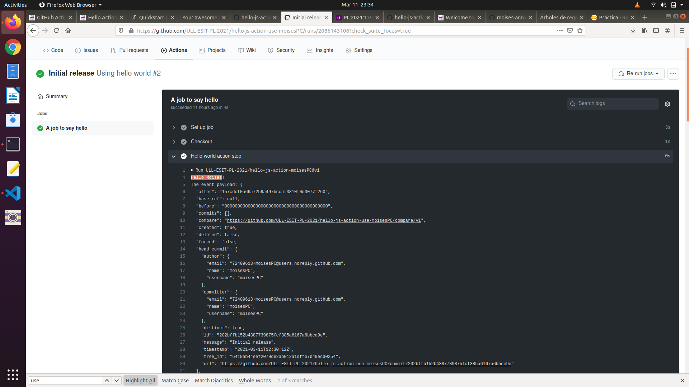
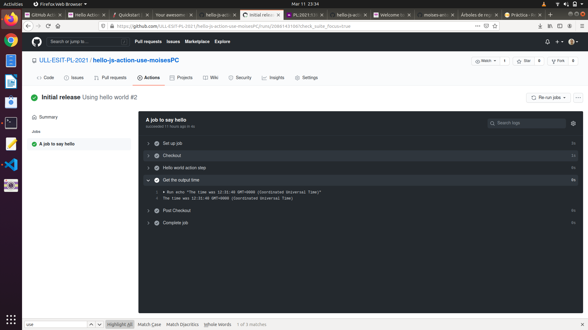
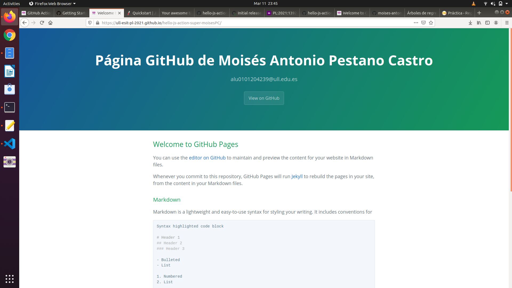
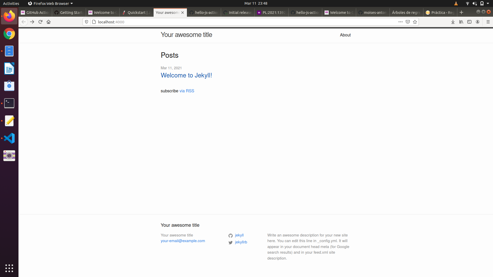
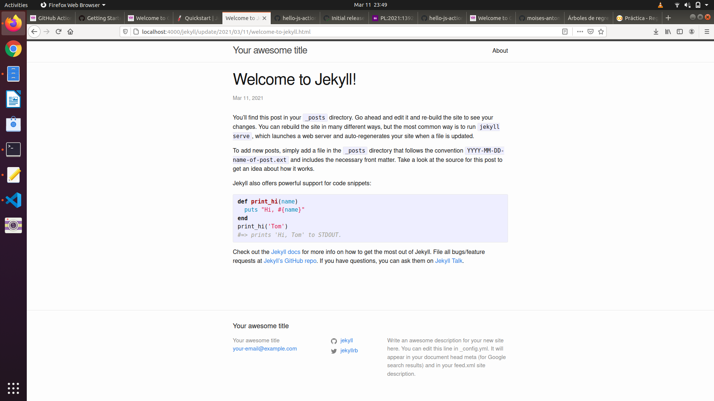

# Práctica GitHub Action Hello World

En esta práctica realicé los siguientes ejercicios:

**1.** Crear una acción de GitHub que:

 * Imprime Hola ***nombre*** por pantalla
 * Imprime la hora utilizando uno de los módulos de [action/toolkit](https://github.com/actions/toolkit).

Para ello, primero cloné mi repositorio (https://github.com/ULL-ESIT-PL-2021/hello-js-action-moisesPC), y luego le añadí el fichero **action.yml**, que contiene los metadatos de nuestra acción:
```
name: 'Hello World'
description: 'Greet someone and record the time'
inputs:
  who-to-greet:  # id of input
    description: 'Who to greet'
    required: true
    default: 'World'
outputs:
  time: # id of output
    description: 'The time we greeted you'
runs:
  using: 'node12'
  main: 'dist/index.js'
```
En él, asigno dos variables: **who-to-greet** (input), que almacena el nombre de la persona a la que decirle *Hello*, y **time** (output), que más adelante le asignaremos el timestamp para poder imprimirlo por pantalla en nuestra acción (esto es posible gracias al módulo de *github.context.payload*)

Luego, creé un fichero **index.js** que servirá como punto de entrada del código de nuestra acción. Algunas líneas de código a destacar son:

```
const nameToGreet = core.getInput('who-to-greet');  // Escribimos el nombre

console.log(`Hello ${nameToGreet}!`);
const time = (new Date()).toTimeString();   // Asignamos la fecha, y luego la convertimos en una string para poder leerla

// Rellenamos la variable "time" con el timestamp que obtuvimos
core.setOutput("time", time);
```

**2.** Probar la acción:

Cloné un nuevo repositorio que almacenará las pruebas de la acción, puediéndo ejecutarla.

Para ello, creamos un nuevo fichero de metadatos para nuestra acción llamado **main.yml** en *.github/workflows*. Este fichero dispondrá de una única tarea (job), denominada **hello_world_job**, que ejecuta varias tareas, entre las cuáles se incluyen:

 * **Hello world action step**: Ejecuta nuestro Hola ***nombre*** desde [el repositorio que configuramos anteriormente (v1)](https://github.com/ULL-ESIT-PL-2021/hello-js-action-moisesPC).
  * Get the output time: Muestra la fecha y hora por pantalla

Finalmente, creamos un nuevo commit con todos los cambios realizados y los mandamos hacia nuestro repositorio en GitHub. Una vez allí, vamos a la opción **Actions** y pinchamos sobre uno de nuestros *workflows*. Dentro del mismo, veremos todas las tareas (jobs) que hemos configurado:




**3.** Publicar nuestra acción:

Ahora podremos publicar nuestra acción yendo al repositorio original, y haciendo click en la opción ***Draft a release***.

**4.** Publicar la página web de GitHub Pages:

Para ello, cloné el repositorio *super-repo* y luego, en GitHub, creé la página web yendo la configuración de GitHub Pages en **Settings**. Le asigné un tema y luego modifiqué ligeramente el fichero **_config.yml** (generado automáticamente en la rama **gh_page** asociada a la página GitHub) añadiéndole un título y una descripción:
```
title: Página GitHub de Moisés Antonio Pestano Castro
description: alu0101204239@ull.edu.es
```



Y con esto se me generó la página web, cuyo enlace es: https://ull-esit-pl-2021.github.io/hello-js-action-super-moisesPC/

**4.** Desplegar una página web utilizando Jekyll

Por último, queda probar el despliegue de una página web de manera local (llamada **myblog**) utilizando Jekyll.

Creé la página con el comando **jekyll new myblog** y luego construí y levanté la página con **bundle exec jekyll serve**. De esta manera, al acceder a http://localhost:4000, puedo ver el contenido de mi página recién creada:


